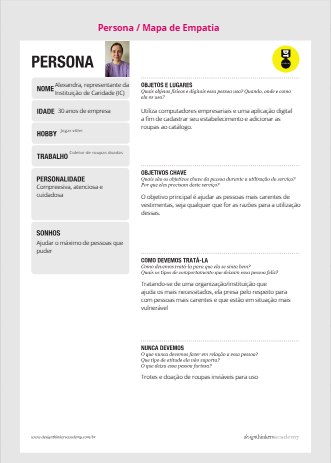
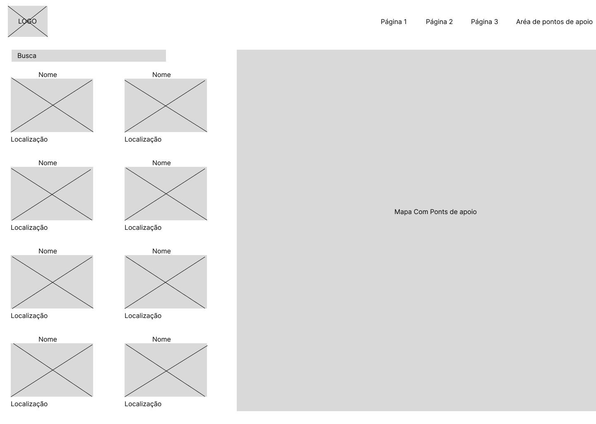
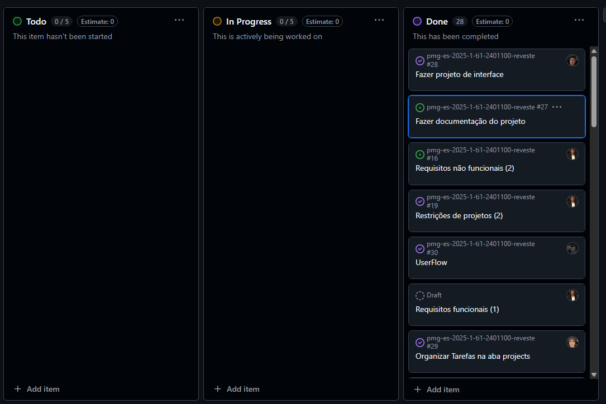

# Introdução

Informações básicas do projeto.

* **Projeto:** Desapegaí
* **Repositório GitHub:** https://github.com/ICEI-PUC-Minas-PMGES-TI/pmg-es-2025-1-ti1-2401100-reveste
* **Membros da equipe:**

  * [Caio Alves Kfuri](https://github.com/caiokfuri)
  * [Bruno Henrique Hoske Aguiar](https://github.com/brunohoske)
  * [Rafael Santos Carvalho](https://github.com/Oieusouopi)
  * [Bernardo Leão Braga](https://github.com/BernardoLBraga)
  * [Bernardo Demaria Santos](https://github.com/bernardo7santos)
  * [Murilo Freitas de Souza](https://github.com/murilofsouzaa)
  * [Rafael Lopes de Souza da Fonseca](https://github.com/Rafael-Fonseca1510)
  * [Gustavo Paulino Cicero](https://github.com/gustavo2702)

A documentação do projeto é estruturada da seguinte forma:

1. Introdução
2. Contexto
3. Product Discovery
4. Product Design
5. Metodologia
6. Solução
7. Referências Bibliográficas

✅ [Documentação de Design Thinking (MIRO)](files/processo-dt.pdf)

# Contexto

## Problema

Atualmente, muitas famílias em situação de vulnerabilidade e pessoas em situação de rua enfrentam dificuldades para obter roupas adequadas. Seja para se proteger do frio ou para manter a dignidade no dia a dia, a falta de vestimentas adequadas é um desafio constante. No entanto, grande parte da população só se mobiliza para ajudar durante o inverno, com campanhas sazonais de doação de agasalhos. É essencial que esse apoio aconteça durante todo o ano, garantindo que essas pessoas tenham acesso contínuo a roupas limpas e em bom estado.


## Objetivos

Nossa proposta é criar uma plataforma que conecte pessoas e famílias em situação de vulnerabilidade a locais que realizam doações de roupas. Além disso, a aplicação permitirá que qualquer pessoa interessada em contribuir saiba onde pode doar peças em bom estado que já não utiliza, facilitando o processo de arrecadação e distribuição ao longo de todo o ano. Dessa forma, buscamos promover um impacto social duradouro e acessível para todos.

O que pensamos e que exista uma aplicação onde computadores fossem instalados em locais específicos (posto de saúde, estação de move, postos policiais) onde possa ter bastante movimento dessas famílias e pessoas necessitadas e esses computadores teriam a aplicação mostrando onde é o ponto de coleta de roupa mais próximo.

## Justificativa

Diante desse cenário, há uma oportunidade significativa para o desenvolvimento de soluções que facilitem e incentivem a doação de roupas em Belo Horizonte. Uma plataforma que conecte doadores a pontos de coleta e distribua eficientemente as roupas para quem precisa pode suprir essa lacuna, garantindo que as doações ocorram de forma contínua e organizada, não apenas em períodos de campanhas sazonais.
Implementar um sistema estruturado de doações pode mitigar os impactos negativos da falta de roupas adequadas entre as populações vulneráveis, melhorando sua qualidade de vida e promovendo a inclusão social.

## Público-Alvo


# Product Discovery

## Etapa de Entendimento

> * **Matriz CSD**
> * 
> * **Mapa de StakeHolders**
> * 
> * **Entrevistas qualitativas e highlights de pesquisa**:
> * **Entrevista qualitativa 1**:
> * 
> * **Entrevista Qualitativa 2**:
> * 
> * **Entrevista Qualitativa 3**:
> * 
> * **Entrevista Qualitativa 4**:
> * 
> * **Entrevista Qualitativa 5**:
> * 
## Etapa de Definição

### Personas

> * **Persona 1**:
> * 
> * **Persona 2**:
> * 
> * **Persona 3**:
> * 


# Product Design

Nesse momento, vamos transformar os insights e validações obtidos em soluções tangíveis e utilizáveis. Essa fase envolve a definição de uma proposta de valor, detalhando a prioridade de cada ideia e a consequente criação de wireframes, mockups e protótipos de alta fidelidade, que detalham a interface e a experiência do usuário.

## Histórias de Usuários

Com base na análise das personas foram identificadas as seguintes histórias de usuários:

| EU COMO...`PERSONA` | QUERO/PRECISO ...`FUNCIONALIDADE`        | PARA ...`MOTIVO/VALOR`               |
| --------------------- | ------------------------------------------ | -------------------------------------- |
| Um representante de uma ONG voltada para a doação de roupas | Uma forma mais prática de informar  as pessoas onde são os pontos de coleta das doações. | Conseguir aumentar o número de peça de roupas coletadas |
| Um indivíduo com roupas em bom estado e que não uso mais | Uma forma mais prática e fácil de encontrar postos de coletas das ONGs      | Conseguir doar minhas roupas e ajudar a comunidade |
| Um indivíduo que costuma doar roupas com frequência | Saber quais são as peças de roupas que as ONGs mais precisam | Conseguir doar minhas roupas e ajudar a comunidade |
| Um indivíduo com roupas em bom estado e que não uso mais | Uma forma mais prática e fácil de encontrar postos de coletas das ONGs      | Conseguir aumentar a diversidade das peças  doadas de cada ONG  |
| Uma pessoa vulnerável com acesso a internet| Achar onde são os locais que eu possa receber roupas doadas | Conseguir ter acesso a roupas, me sentindo mais digno |
| Um representante de uma ONG que atende pessoas em situação de vulnerabilidade | Encontrar uma forma de informar as pessoas quais são as peças de roupas que mais precisamos | Que não recebamos tipos de peças de roupas de mais e outras de menos (ficando desigual os tipos de peças) |
| Uma pessoa vulnerável com acesso a internet | Saber quais são os tipos de roupas disponíveis para doação no estabelecimento | Saber se  consigo utilizar aquela peça e se é útil para mim. |
| Um voluntário que deseja ajudar na distribuição de roupas para pessoas necessitadas |Uma plataforma que me permita organizar e acompanhar doações e entregas de algumas ONGs  | Saiba onde e como e candidatar ao voluntariado dessas ONGs. |
| Representante de uma empresa que deseja realizar uma campanha de doação de roupas entre seus funcionários | Uma plataforma que facilite a coleta, o cadastro e a entrega das doações para as ONGs parceiras | Promover a responsabilidade social da empresa e engajar os funcionários em ações de solidariedade |

## Proposta de Valor

> * **Prosposta de valores**
> * **Persona 1**:
> * 
> * **Persona 2**:
> * 
> * **Persona 3**:
> * 

## Requisitos

As tabelas que se seguem apresentam os requisitos funcionais e não funcionais que detalham o escopo do projeto.

### Requisitos Funcionais

| ID     | Descrição do Requisito                                   | Prioridade |
| ------ | ---------------------------------------------------------- | ---------- |
| RF-001 | O sistema deve mostrar quais peças de roupas cada ONG mais necessita | ALTA       |
| RF-002 | O sistema deve permitir cada representante cadastrar sua ONG | MÉDIA     |
| RF-003 | O sistema deve possibilitar cada ONG cadastrada publicar informações sobre os postos de coletas e retiradas de doações; | MÉDIA     |
| RF-004 | Tanto os doadores quanto as pessoas que irão receber as doações devem poder visualizar os locais de coleta e retirada de doações de cada ONG específica | MÉDIA |
| RF-005 | O sistema deve permitir salvar as ONGs preferidas | BAIXA |
| RF-006 | O sistema deve permitir que os estabelecimentos sejam localizados através de geolocalização | BAIXA |
| RF-007 | O sistema deve permitir cadastrar estabelecimentos temporários | MÉDIA     |
| RF-008 | O sistema deve permitir filtrar os establecimentos através de pesquisas | BAIXA     |
| RF-009 | O sistema deve permitir as ONGs cadastrar seus estabelecimentos | ALTA     |
| RF-010 | O sistema deve permitir que os usuários que irão doar agendem sua doação | MÉDIA     |

### Requisitos não Funcionais

| ID      | Descrição do Requisito                                                              | Prioridade |
| ------- | ------------------------------------------------------------------------------------- | ---------- |
| RNF-001 | A aplicação deve rodar para diferentes navegadores (google chrome, firefox, safari) pelo menos os mais usados. | ALTO     |
| RNF-002 | Seguir princípios de design responsivo (mobile first)          | MÉDIA      |
| RNF-003 | O uso do localStorage deve ser otimizado, evitando salvar dados desnecessários para não comprometer o desempenho.        | ALTO      |
| RNF-004 | Código e arquivos CSS/JS devem ser minificados para reduzir o tempo de carregamento.         | BAIXA      |
| RNF-005 | Todos os formulários devem ter validações visíveis para orientar o usuário.       | MÉDIA      |

### Restrições de projetos
| ID      | Descrição da Restrição                                                              | Prioridade |
| ------- | ------------------------------------------------------------------------------------- | ---------- |
| RP-001 | O projeto deve ser desenvolvido apenas com HTML, CSS e JavaScript. | ALTO     |
| RP-002 | A aplicação deve rodar 100% no lado do cliente (client-side), sem backend.          | ALTO      |
| RP-003 | As funcionalidades implementadas devem seguir estritamente o escopo definido, sem adição de recursos extras.      | ALTO      |


## Projeto de Interface

Artefatos relacionados com a interface e a interacão do usuário na proposta de solução.

### Wireframes

Estes são os protótipos de telas do sistema.

HOME PAGE

> 
>
>Tela Inicial da aplicação, onde o usuário irá informar o que ele é (Doador, Beneficiário, Ponto de apoio)

Seleção de Ponto de Apoio

> 
>
>Tela onde o doador ou beneficiário poderá ver locais de apoio perto dele(a) e acessar seu estoque.


Painel de estoque

> 
>
>Tela onde vai ser possível do usuário vizualizar o estoque de um ponto de apoio.

Cadastro Ponto de Apoio

> 
>
>Tela onde os pontos de apoio irão se cadastrar na plataforma.

Login Ponto de Apoio
> 
>
>Tela onde pontos de apoio já cadastrados poderão entrar na plataforma

Cadastro de doações

> 
>
>Tela onde doadores poderão agendar uma doação em um ponto de apoio

Painel de Gestão Ponto de Apoio

> 
>
>Tela onde o local de apoio irá administrar estoque, agendamentos e outras configurações

### User Flow
**User Flow**


### Protótipo Interativo

[Protótipo Interativo (MarvelApp)](https://marvelapp.com/prototype/34186c06)

# Metodologia

Detalhes sobre a organização do grupo e o ferramental empregado.

## Ferramentas

Relação de ferramentas empregadas pelo grupo durante o projeto.

| Ambiente                    | Plataforma | Link de acesso                                     |
| --------------------------- | ---------- | -------------------------------------------------- |
| Processo de Design Thinking | Miro       | [MIRO](https://miro.com/app/board/uXjVIGInpEk=/) |
| Repositório de código     | GitHub     | [Repostório](https://github.com/ICEI-PUC-Minas-PMGES-TI/pmg-es-2025-1-ti1-2401100-reveste) |
| Protótipo Interativo       | MarvelApp  | [Prototipo](https://marvelapp.com/prototype/34186c06)|
| Comunicação         | WhatsApp           |  [WhatsApp](https://web.whatsapp.com/)|
| Diagramação | Figma | [Figma](https://www.figma.com/design/2bVvGTvSVjfC7qbCE777eQ/Desapegaí?node-id=0-1&t=fbQftLfk2K2iNxSR-1) | 
| Editor de Código | VSCODE | [VSCODE](https://code.visualstudio.com/)

> Listagem das ferramentas
> * (1) VSCODE
> Escolhemos o VSCODE porque ele oferece uma variedade de extensões que facilitaram a codificação do site, além de ser integrado com o GIT, trazendo facilidade nos commits, pulls etc.
> * (2) MIRO
> Utilizamos o MIRO porque além de ter sido recomendado pelos professores, já tinha alguns modelos do que devia ser preenchhido.
> * (3) WhatsApp
> Utilizamos o WhatsApp como meio de comunicação por ser mais acessível pra todos.
> * (4) Github
> Utilizamos o GITHUB por ser uma ferramenta muito poderosa.
> * (5) MarvelApp
> Foi usado para fazer o prototipo interativo, por ser muito intuitivo.
> * (6) Figma
> Utilizamos o figma para fazer a prototipação, por ser muito intuitivo também.

## Gerenciamento do Projeto

Divisão de papéis no grupo e apresentação da estrutura da ferramenta de controle de tarefas (Kanban).

**PROJECTS GITHUB**
> 
>
> Nessa imagem podemos ver a organização de tarefas, com elas sendo encaminhadas para os respectivos membros
> 

# Solução Implementada

Esta seção apresenta todos os detalhes da solução criada no projeto.

## Vídeo do Projeto

O vídeo a seguir traz uma apresentação do problema que a equipe está tratando e a proposta de solução. ⚠️ EXEMPLO ⚠️

[](https://www.youtube.com/embed/70gGoFyGeqQ)

> ⚠️ **APAGUE ESSA PARTE ANTES DE ENTREGAR SEU TRABALHO**
>
> O video de apresentação é voltado para que o público externo possa conhecer a solução. O formato é livre, sendo importante que seja apresentado o problema e a solução numa linguagem descomplicada e direta.
>
> Inclua um link para o vídeo do projeto.

## Funcionalidades

Esta seção apresenta as funcionalidades da solução.Info

##### Funcionalidade 1 - Cadastro de Contatos ⚠️ EXEMPLO ⚠️

Permite a inclusão, leitura, alteração e exclusão de contatos para o sistema

* **Estrutura de dados:** [Contatos](#ti_ed_contatos)
* **Instruções de acesso:**
  * Abra o site e efetue o login
  * Acesse o menu principal e escolha a opção Cadastros
  * Em seguida, escolha a opção Contatos
* **Tela da funcionalidade**:


> ⚠️ **APAGUE ESSA PARTE ANTES DE ENTREGAR SEU TRABALHO**
>
> Apresente cada uma das funcionalidades que a aplicação fornece tanto para os usuários quanto aos administradores da solução.
>
> Inclua, para cada funcionalidade, itens como: (1) titulos e descrição da funcionalidade; (2) Estrutura de dados associada; (3) o detalhe sobre as instruções de acesso e uso.

## Estruturas de Dados

Descrição das estruturas de dados utilizadas na solução com exemplos no formato JSON.Info

##### Estrutura de Dados - Contatos   ⚠️ EXEMPLO ⚠️

Contatos da aplicação

```json
  {
    "id": 1,
    "nome": "Leanne Graham",
    "cidade": "Belo Horizonte",
    "categoria": "amigos",
    "email": "Sincere@april.biz",
    "telefone": "1-770-736-8031",
    "website": "hildegard.org"
  }
  
```

##### Estrutura de Dados - Usuários  ⚠️ EXEMPLO ⚠️

Registro dos usuários do sistema utilizados para login e para o perfil do sistema

```json
  {
    id: "eed55b91-45be-4f2c-81bc-7686135503f9",
    email: "admin@abc.com",
    id: "eed55b91-45be-4f2c-81bc-7686135503f9",
    login: "admin",
    nome: "Administrador do Sistema",
    senha: "123"
  }
```

> ⚠️ **APAGUE ESSA PARTE ANTES DE ENTREGAR SEU TRABALHO**
>
> Apresente as estruturas de dados utilizadas na solução tanto para dados utilizados na essência da aplicação quanto outras estruturas que foram criadas para algum tipo de configuração
>
> Nomeie a estrutura, coloque uma descrição sucinta e apresente um exemplo em formato JSON.
>
> **Orientações:**
>
> * [JSON Introduction](https://www.w3schools.com/js/js_json_intro.asp)
> * [Trabalhando com JSON - Aprendendo desenvolvimento web | MDN](https://developer.mozilla.org/pt-BR/docs/Learn/JavaScript/Objects/JSON)

## Módulos e APIs

Esta seção apresenta os módulos e APIs utilizados na solução

**Images**:

* Unsplash - [https://unsplash.com/](https://unsplash.com/) ⚠️ EXEMPLO ⚠️

**Fonts:**

* Icons Font Face - [https://fontawesome.com/](https://fontawesome.com/) ⚠️ EXEMPLO ⚠️

**Scripts:**

* jQuery - [http://www.jquery.com/](http://www.jquery.com/) ⚠️ EXEMPLO ⚠️
* Bootstrap 4 - [http://getbootstrap.com/](http://getbootstrap.com/) ⚠️ EXEMPLO ⚠️

> ⚠️ **APAGUE ESSA PARTE ANTES DE ENTREGAR SEU TRABALHO**
>
> Apresente os módulos e APIs utilizados no desenvolvimento da solução. Inclua itens como: (1) Frameworks, bibliotecas, módulos, etc. utilizados no desenvolvimento da solução; (2) APIs utilizadas para acesso a dados, serviços, etc.

# Referências

As referências utilizadas no trabalho foram:

* [ESTADO DE MINAS. BH: Servas lança campanha para arrecadar itens de inverno: saiba como doar. 10 jun. 2024. Disponível em:](https://www.em.com.br/gerais/2024/06/6875041-bh-servas-lanca-campanha-para-arrecadar-itens-de-inverno-saiba-como-doar.html)

* [NOVA ACRÓPOLE. Voluntários da Nova Acrópole Savassi realizam recolhimento de roupas para doação à Dreminas. 2024. Disponível em:](https://nova-acropole.org.br/noticias/savassi/voluntarios-da-nova-acropole-savassi-realizam-recolhimento-de-roupas-para-doacao-a-dreminas/)

* [JORNAL DE BRASÍLIA. Grupo HOPE cria projeto de doação de roupas chamado “Doe Esperança”. 19 jan. 2024. Disponível em: ](https://jornaldebrasilia.com.br/blogs-e-colunas/analice-nicolau/grupo-hope-cria-projeto-de-doacao-de-roupas-chamado-doe-esperanca/)
